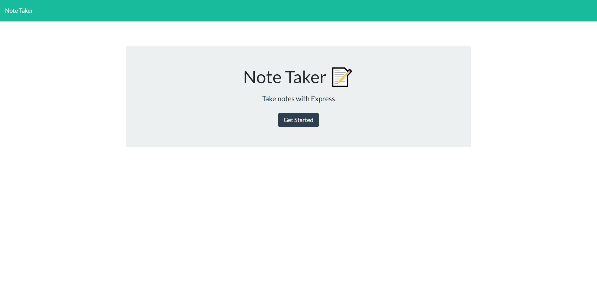
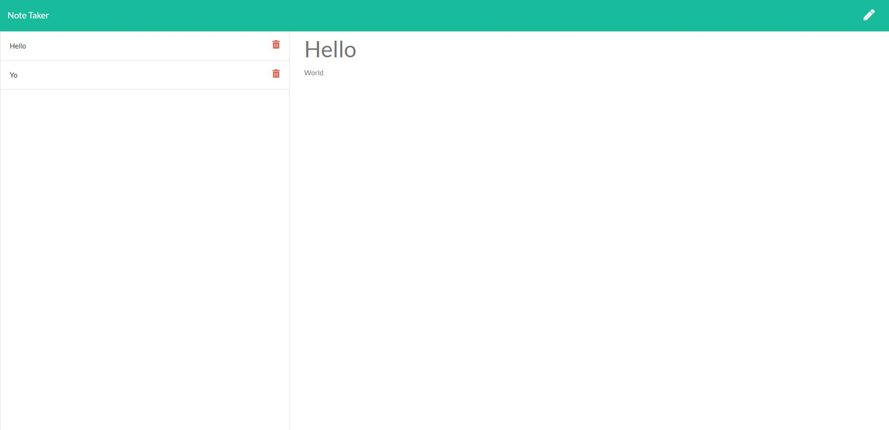

# Note Taker

This application uses express backend to write, save, and delete notes from a JSON file. 

[Note Taker](https://drive.google.com/file/d/1TNf6tot9HryqUInftu65i-4acMOm0ygH/view?usp=sharing) is hosted on Heroku

This application was authored by [Seth Martineau](https://github.com/slothings)